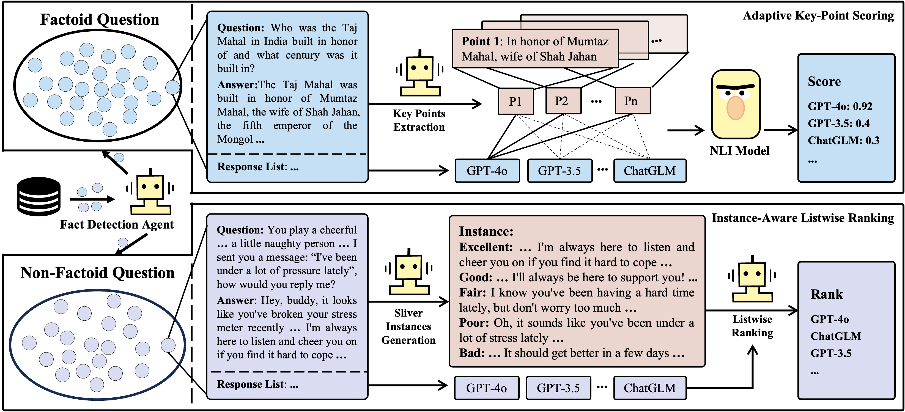

# MinosEval: Distinguishing Factoid and Non-Factoid for Tailored Open-Ended QA Evaluation with LLMs

## Introduction

Welcome to MinosEval, a novel two-stage approach for evaluating open-ended QA and providing corresponding interpretive information. It distinguishes between factoid and non-factoid questions based on their semantic and content differences, employing tailored evaluation strategies for each type of question.

  

